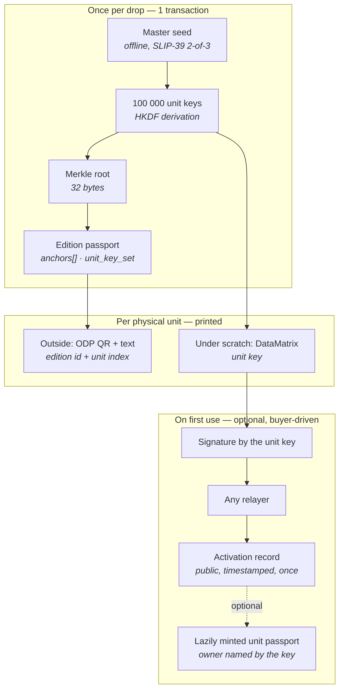

> **Historical / superseded for ABI `0.7-redesign-8`.** The old diagrams, unit-passport/owner hooks, first-activation revocation lock, passportId-based key derivation and ready-reader claims below are superseded. ABI6 uses nonce-based v2, typed commitment and no unit passports; copied signatures/activation are not clone detection or ownership proof. Current rules: [SPEC](../SPEC.md), [app handoff](../ODP_07_APP_HANDOFF.md), [glossary](GLOSSARY.md), [documentation delta](../ODP_07_ABI6_DOCUMENTATION_DELTA.md). No wallet or external-network actions are authorized by this page.

# Edition passports and unit activation keys

*Design note for the **v0.7** line. **Non-normative** — this document records the decisions and their rationale. The binding rules are **[`SPEC.md` §20](../SPEC.md#20-edition-keys-and-activation)**; where the two disagree, the spec wins.*

*Status: draft · Author: Andrei Chernikov · RU mirror: [`ru/EDITION_UNIT_KEYS.md`](ru/EDITION_UNIT_KEYS.md)*

---

## 1. The problem this solves

The v0.6 model assumes one passport per object. That is right for a painting and wrong for a series of blind-box figures produced in tens or hundreds of thousands of identical units.

Three things break at that scale:

| | v0.6 single-object model | Mass-produced edition |
|---|---|---|
| Identification anchors | unique per object | **identical across the whole run** — same photo, same dimensions, same materials |
| Cost | one mint per object, negligible | 100 000 mints per drop, and ~90 % of them never read by anyone |
| Seal | NTAG 424 DNA TagTamper (~$0.30–0.60 per chip) | prohibitive on a $15 unit |

So the unit of registration has to change: **the passport describes the edition, and each physical unit carries a key that proves membership in it.**

### B profiles only

This is a **`B`-profile (brand) feature, enforced by the contract** — not a convention. A `C`, `P`, or `M` wallet cannot mint an edition passport or open a unit-key set (`SPEC.md` §20.1). Nothing in §§6–9 changes for those profiles.

Three reasons the gate is in the contract rather than in guidance:

1. The mechanism describes an **industrial production run**. A creator registering their own work and a museum registering holdings are already served by the per-object model and gain nothing here.
2. Its safety rests on the issuer being able to run a controlled key ceremony (§4) and to print at a secure facility. That is an organizational capability, and `B` is the profile that claims it.
3. **A mis-issued key set cannot be revoked per unit.** Once 100 000 codes are printed and shipped, the only remedy is revoking the whole edition passport. Restricting who can create one keeps the blast radius with the profile type that has a production process behind it.

Activation and unit-passport minting are **not** gated: they are driven by buyers holding unit keys, who need no ODP profile and no wallet.

## 2. What the industry does today, and why it is not enough

The dominant mechanism for mass-produced authentication — used by Pop Mart and by essentially every security-label vendor — is a scratch-off panel hiding a serialized code, checked against the brand's own database. Date, time and location of the *first* check are logged; a second checker sees "already verified three weeks ago in another country".

The mechanism is sound. Its foundations are not:

1. **The brand is the judge.** "Genuine" means only "the brand's server said so today". The server can be switched off, the company sold, the database rewritten.
2. **The verification page is the attack surface.** A live clone of Pop Mart's checker sits at a lookalike domain and answers *every* code with "Genuine. First Time Verification" — so a buyer following a QR from a counterfeit box gets a green tick from a page that never queried anything. There is nothing a diligent buyer can check: the answer comes from whichever server the code sent them to. Separately, an insider at the brand or the print vendor sees every code before a single box ships. (An earlier draft of this note claimed Pop Mart publicly warns about codes cloned from stolen database dumps; no first-party statement to that effect could be found, and the clone site is the stronger and directly observable point.)
3. **The first-check log is private.** The buyer cannot verify it — only trust the screen.
4. **"No record" proves nothing**, and "record found" proves nothing either.

ODP's contribution is not another scratch code. It is **moving the judge out of the brand**: the code is bound to the passport by a hash, the first use is a public timestamped event, and verification keeps working when the brand does not.

## 3. Model overview



### 3.1 The edition passport

One ordinary ODP passport per edition, minted by a B profile, carrying the usual v0.6 identification minimum — the anchors describe the *edition*, not any single unit.

It gains one new anchor type:

**`unit_key_set`**

| Field | Required | Meaning |
|---|---|---|
| `merkleRoot` | yes | Root over all unit leaves |
| `unitCount` | yes | Number of units in the run |
| `leafFormat` | yes | How a leaf is built (see below) |
| `hashAlg` | yes | `sha256` in the first version |

**Leaf format:** `leaf_i = SHA-256( uint32be(i) ‖ unitAddress_i )`

The unit index is inside the leaf on purpose: it welds serial numbers to addresses before printing, so a code from box #7 cannot later be presented as box #48 231.

The full list of unit addresses is published as an ordinary public file next to the `.odpass` bundle (~2 MB for 100 000 units, nothing secret in it). Anyone can rebuild the tree and any Merkle proof from it, so the printed carrier does not have to hold the proof.

**Cost:** 100 000 units add **32 bytes** to the chain. One mint, ~$0.02.

### 3.2 Blind-box variant commitment (optional)

For blind-box products, the packer knows which SKU went into which box. Publishing that would destroy the product; publishing a *commitment* to it does not:

**`unit_variant_commit`** — a second Merkle root over `SHA-256( uint32be(i) ‖ variant_i ‖ salt_i )`.

The salt is printed on a card **inside** the sealed package. Opening the box yields it; the chain then confirms that box #48 231 was officially recorded as containing the chase variant. On a secondary market where chase figures resell at 10–50× and rarity claims rest on the seller's word, this is the feature brands will actually pay for — **provable rarity**, not abstract anti-counterfeiting.

**Why the salt is inside the box and not derived from the unit key.** An earlier draft recommended deriving it from the unit key, so that opening the unit would yield the salt and the brand would be out of the reveal path. That was a serious break, and it is worth keeping visible. A blind-box series has perhaps thirteen possible variants, so the commitment is protected by the secrecy of the salt and by nothing else — anyone holding the salt just computes the commitment for all thirteen candidates and reads off the answer. And the scratch layer is on the *outside* of the package: a reseller could scratch the label without opening the box, derive the salt, learn what is inside, keep the chase units, and sell the rest as "sealed, never opened". The blind box would stop being blind.

Putting the salt inside the package protects the variant with the same cardboard that protects the surprise, and keeps the brand out of the reveal path for real — nothing has to be requested from it, and rarity is still provable after it is gone.

Three properties follow. A mismatched card is **fail-safe**: it cannot prove a variant the unit does not have, only fail to prove the one it does. A **lost card means rarity is unprovable forever**, since the salt is not recoverable — a brand may keep copies as a courtesy, but nothing may depend on it. And it does nothing against the packer, who knows the contents by definition, or against weighing and candling, which are pre-existing problems of blind boxes and not ours.

### 3.3 Unit keys

Keys are **derived, not stored**:

```
issuer side:
  masterSeed     = 256 random bits, generated offline
  unitSecret_i   = HKDF-SHA256(masterSeed, info = editionContext ‖ uint32be(i))
  printedSeed_i  = leading 100 bits of unitSecret_i      ← this is what gets printed

either side, from the printed code alone:
  unitKey_i      = secp256k1 key from SHA-256("ODP-UNIT-KEY-v1" ‖ printedSeed_i ‖ editionContext)
  unitAddress_i  = corresponding address
```

The split matters. The issuer derives everything from one master seed; the buyer, holding nothing but 20 scratched characters, reaches the same address without needing anything the issuer kept. An earlier draft had the printed value and the derived key at different sizes and never bridged them — the buyer could not actually have got to the key.

`editionContext` binds the derivation to one edition so that seeds never collide across drops.

Consequence: the brand stores **one seed**, not a hundred thousand secrets.

### 3.4 The printed code

| Property | Decision |
|---|---|
| Primary carrier | **DataMatrix under the scratch layer** — scratch, point camera, done |
| Fallback | 25 characters of text for damaged or smudged symbols |
| Text format | 20 payload characters (~100 bit) + 5 check characters, Crockford Base32 (no `O/0`, `I/1`, `L`, `U`) |
| Check characters | first 25 bits of `SHA-256(payload)` |
| Entropy floor | **≥ 80 bit — hard requirement** |

**The checksum reuses SHA-256 on purpose.** An earlier draft said only "5 check characters computed over the payload" and never named an algorithm — by that text two implementations would compute different check characters and reject each other's valid codes. SHA-256 is already a hard dependency everywhere in ODP, so this adds no library and no lookup table, and 25 bits reject a typo about 33 million times out of 33 million and one.

**The alphabet is global and is not localized.** The text form is the minority path — most people scratch and scan — while a per-market alphabet would make every verifier guess, forever, which alphabet a string was written in, and would let the same string mean different things in different countries. Normalization is specified instead: uppercase, drop hyphens, map `O`→`0` and `I`/`L`→`1` before hashing, so transcription slips still produce a valid code.

The entropy floor is a direct consequence of decentralization and is easy to get wrong. In a server-based system an 8-character code is safe because the server rate-limits guessing. **ODP has no server.** The address list is public and verification runs offline, so an attacker can grind candidate codes locally at millions per second with nobody watching. Short codes are not an option here, and this cannot be fixed after the labels are printed.

### 3.5 The label

**Outside, open** — the ordinary ODP verification label, extended with the unit index: a QR carrying the edition passport ID and the unit index, plus both values in **human-readable text**.

The spec fixes *what must be recoverable*, not the encoding. The text line is the part that matters most: carrier formats change over the life of a protocol, and a pair of values a human can type is what keeps a unit verifiable when they do.

**The stronger EU argument is not the carrier — it is the back-up clause.** Regulation (EU) 2024/1781 requires that a product passport be backed up through a digital product passport service provider that is an independent third party, so that the record survives the economic operator that issued it. That is not a format ODP happens to share; it is the property ODP delivers structurally, because the registry is a public chain and the verifier is anyone. A compliance officer already has a budget line for it.

**GS1 Digital Link is the documented next step, not a requirement.** A brand holding a GTIN can encode a GS1 Digital Link URI instead, so one symbol serves retail scanners, ODP verification, and EU DPP resolution under ESPR (batteries from February 2027, textiles and furniture 2027–2028, electronics through 2030) — and then the brand never has to choose between ODP and the compliance carrier it will need anyway.

It is deliberately not mandatory now, because it costs nothing to adopt later. The carrier is off-chain packaging chosen per print run: a later run can switch encoding without touching the contract, the registry, or any minted passport, labels already printed keep working, and one brand can even run both formats across different drops. Requiring GTIN today would have excluded every studio that never sells through a retail scanner, in exchange for a benefit that waits patiently.

**Optionally signed.** An edition can print a signature into the outer QR, checkable against a key published in the passport and on-chain. A reader in a shop, with no network, then knows the label was printed by the brand. Without it the outer label is plaintext anyone can print — and a counterfeiter who prints one can also host the page that says it is genuine, which is a thing that already exists (§2).

This is the idea of ISO/IEC 20248, with the signer's key taken from the edition passport instead of a PKI or a DNS record. The standard leaves key management out of scope, so this fills a slot rather than bending a rule — and it avoids reintroducing the issuer-domain dependency the address-list rule exists to remove. Full reasoning in [ADR-0011](adr/0011-signed-outer-labels-with-an-on-chain-signer-key.md).

It stops labels being **invented**, not **copied**: a photo of a real label reproduces a valid signature. Copying is what activation catches. Signing is optional and most editions will not use it, so a plain label is not a worse label.

**Under the scratch layer** — the DataMatrix from §3.4.

**Physical requirement:** the label must be applied across the package seam so that removing it is visibly destructive. This is the *only* physical binding in the whole scheme; everything cryptographic sits on top of it.

## 4. Key ceremony

Generation happens on an offline machine using a reference CLI shipped with the protocol. The master seed is split with **SLIP-39** (Shamir) in a **2-of-3** configuration:

| Share | Holder |
|---|---|
| 1 | Brand security officer |
| 2 | A different department — legal or finance, separate safe |
| 3 | Notarial or bank escrow |

Any two shares reconstruct the seed; **one share yields nothing** — not a halved search space, no information at all. No individual can regenerate the codes; losing one safe does not lose the run; reprinting requires two people and leaves a trail.

The corporate-security vocabulary for this is **split knowledge** and **dual control** (NIST SP 800-57 Part 2; PCI PIN Security requirements). Brands' security teams already operate under these terms — this does not need explaining from scratch.

**Printing** must happen at a facility with security-print management, i.e. **ISO 14298**. See §8.2 for why this is an organizational control and not a cryptographic one.

**Optional attestation of the ceremony.** No new mechanism is needed: a witness holding a **P profile** publishes an ordinary `submitProof` against the edition passport on `ODPPassportProofRegistry` — "the key ceremony for edition X was performed under the ODP profile, shares split, seed never left the offline machine, on date Y". The edition then reaches the existing **Attested** tier, which now also carries meaning about the *process*, not only the object. Zero new core code.

### 4.1 What ODP itself must never do

**ODP cannot hold a share, a seed, or a key — for any edition, ever.**

The project's core promise is that passports outlive the project ("what happens if the project's site disappears? The passports survive it"). The moment ODP custodies fragments of third-party production secrets, it acquires servers that cannot be switched off, liability, insurance and a legal entity — exactly the centralization the protocol exists to avoid.

ODP's role here is **to be text, not a participant**:

1. **Normative format** in `SPEC.md` — derivation, Merkle construction, code encoding, the `unit_key_set` anchor. Required, or third-party verifiers cannot check anything.
2. **A ceremony profile** — a recommendation-level document in the genre of [`ISSUER_NFC_FLOW.md`](ISSUER_NFC_FLOW.md): who is present, what is destroyed, what is signed off.
3. **A reference offline CLI** under MIT, run by the brand on its own air-gapped machine. ODP stores nothing.

## 5. Activation

Activation is a **signature**, not a service call.

```
message = domain separator
        ‖ chainId ‖ contract address
        ‖ edition passport id
        ‖ unit index
        ‖ action = "activate"
signed by unitKey_i
```

Rules:

- **The on-chain function is permissionless.** It authenticates the *signature*, not `msg.sender`. Whoever submits the transaction is a courier and gets no rights from it.
- **Anyone may publish**: the brand's server, a marketplace, a collector's club, any ODP-aware application minting from its own wallet, or the buyer's own wallet as the last-resort path.
- **A signature can be held and published later** — offline for a year, from someone else's phone, after the brand is gone.
- **Recorded once.** The first valid activation is written with its block timestamp; later submissions are no-ops returning the existing record.
- **Gasless for the holder when a sponsor pays** — no wallet, no tokens, no account in that path. If nobody will carry it, the holder publishes from their own wallet and the record is identical. "Free" is a property of a funded deposit, not a guarantee the protocol makes.
- **A duplicate submission reverts.** Otherwise anyone holding one genuine code could replay the same valid signature forever: the record would never change and the fee would be charged every time, draining whoever pays. Reverting makes the duplicate fail in a dry run, before any money moves.

**Sponsorship lives on-chain, not on a server.** A blockchain cannot send its own transactions — something off-chain has to sign and broadcast, and no design changes that. What can be decided is where the *rules* live.

If an issuer covers activation fees through a server, the policy is invisible: it can quietly refuse one holder, favour some units, or simply disappear, and nobody outside can tell which happened. If it covers them through an on-chain **paymaster** (ERC-4337) funded by an on-chain deposit, the policy is public bytecode anyone can read, and the transport is the public bundler network rather than the brand's endpoint — the issuer funds the deposit but never stands between a holder and the chain. When the deposit runs dry, holders self-publish and nothing breaks.

Because the message is fully specified by the spec, no agreement with anyone — brand or ODP — is required to become an activation point. This is what keeps the promise "the passports survive us" true for this feature and not only for the registry.

**Activation is not minting.** It writes one small record against an already-minted edition passport. Creating a passport for the individual unit (§6) is a separate action with separate economics — see below. Nothing in this section makes that one free.

## 6. Ownership: the bearer model

On activation, a **unit passport may be lazily minted** — created only when someone actually needs it, rather than 100 000 times in advance. It is parented to the edition passport, with membership proven by a Merkle proof, and from there lives by ordinary ODP rules: owner-supplied photo anchors, append-only events, transfers, attestations.

**The key names the owner; anyone may pay.** The mint is authorized by a message signed with the unit key that states the owner address explicitly, and the contract takes the owner from that message rather than from whoever sent the transaction.

This falls out of the mint being paid (below). An earlier draft made the unit address the owner unconditionally — which, once the minter pays, means paying for a passport you do not own and then paying again to transfer it to yourself. Naming the owner in the signature collapses that into one transaction and covers all three real cases:

| Situation | Owner named in the signature |
|---|---|
| Buyer has a wallet | their own address — pays and owns in one step |
| Brand runs a minting service | **the buyer's address**, not the brand's |
| Holder wants no wallet at all | the unit address — the bearer path, unchanged |

The bearer path therefore survives as an option rather than as the only rule: whoever holds the code holds the passport, which is exactly the physics of a code sitting inside a box that travels with the object. Lose the box, lose the passport — and a transfer to a real wallet later is one signature with the same key.

One guard comes with it — no mint before the unit is activated — and one that was drafted and then deliberately removed.

**Why there is no "one passport per unit" rule.** It was written in, and it was a mistake worth keeping on the record. Consider a counterfeiter who cloned a real box including its code, and whose buyer mints first. With a uniqueness rule, the holder of the *genuine* unit is not merely shown a conflict — they can never obtain a unit passport at all, permanently, by a single transaction from someone else. That is the "first-to-register weapon" this project already rejected when it declined to enforce global `dataHash` uniqueness in v0.6, and the same reasoning applies here with more force: a surfaced conflict is recoverable by evidence, a lock-out is not.

So competing unit passports are allowed, and the verifier reports all of them — mint time, owner, minting profile — unranked and without a verdict. The cost is honest: the registry can hold two passports for one figure, and a human resolves it from activation timing, issuer identity, and photographs.

**The unit passport mint is always paid by whoever mints it.** It is an ordinary mint: a wallet, a transaction, a network fee.

An earlier draft of this note suggested the brand could cover it "for the first year after the drop". That was wrong, and worth recording as a mistake rather than quietly deleting: **there is no way to express it.** The protocol has no escrow, no per-edition allowance, no expiry, and no notion of a sponsor. Any such arrangement would live entirely off-chain, in a service the brand runs at its own discretion and can switch off without notice — which is exactly the dependency this whole design exists to remove. Writing it into the specification as a "default" would have promised something no verifier could check and no buyer could rely on.

A brand that wants to absorb the cost has exactly one honest route: run its own minting service and pay from its own wallet. That is a commercial offer by that brand, not a protocol feature, and it must never be described as one.

## 7. When the code was already activated

The verifier **states the fact and the timestamp, and stops there.** No verdict, no accusation, no complaint button.

This follows the position v0.6 already takes on duplicate passports: the protocol does not decide which of two competing records is "the real one"; it surfaces the signals and leaves the judgement to people. A conflict has two innocent readings — a cloned code, or a legitimately second-hand item — and the protocol can distinguish neither.

`ODPCounterfeitConcern` remains available as a separate, general-purpose mechanism. It is deliberately **not** wired into this flow.

## 7a. Recall: removed, and what replaced it

An edition passport is immutable like any other, and v0.6's only remedy for a wrong immutable card is revoke + re-mint. On a run of 100 000 units that remedy is a weapon: revocation strips the assurance tier entirely and blocks further events, so one transaction — by the issuer, or by `governance` — would wipe the record of every honest holder at once. That is the same locked door we refused for unit passports, with the key handed to the brand.

So recall is gone, and two mechanisms take its place.

**A revocation window that closes on one fact.** An edition may be revoked only until the first unit of it is activated. That single event closes the door permanently, for every caller including `governance`. Inside the window a typo caught in the warehouse is fixed the ordinary way and nobody is harmed; after it, no one can erase anything.

The gate is deliberately not a date. A declared shipping date is fixed in an immutable anchor at mint, and production schedules move — so a two-month delay would either slam the door while nothing had shipped, or leave it open while boxes sat on shelves, and the only fix would be re-minting the edition because logistics slipped. A plan is not a fact.

An issuer-declared "we have shipped" event was specified and then removed. It closed the window earlier, but it cost a second mechanism, a second event kind, and a second thing an issuer could simply decline to do — and it only covered the gap between goods reaching shelves and the first buyer scratching a label, which is short and closes itself. One rule beat two.

**Edition notices replace recall afterwards.** After the window closes, the issuer can still say something went wrong — superseded by a corrected edition, key set leaked, safety recall — as an append-only notice that destroys nothing. The critical part: a notice must be shown on the edition **and on every unit passport under it**. A warning that only appears on the parent record is invisible to the person holding one figure.

A notice is never a verdict on an individual unit. "This edition's key set leaked" says something about the run, not about the object in someone's hands.

**And a notice stays prose — there is no "superseded by" field.** This looks like an omission and is not one. Minting a corrected edition does not rescue units already in shops: their keys sit in the *old* edition's Merkle root, verify against it, and always will. A successor edition has its own key set and governs later production only.

So the units of a superseded edition are neither obsolete nor invalid — the figure in someone's hands is genuine, its code is honest, its verification passes. A structured pointer would be rendered by every interface as "your edition is out of date", which is precisely the verdict we removed from conflicting passports, from mint order, and from notices themselves. Prose says the true thing — "the author's name is misspelled in this edition's card; the corrected one is ODP-…" — and a machine cannot turn it into a sentence.

## 8. Honest limits

None of the following is fixed by this design, and none should be implied in product copy.

### 8.1 The brand knows every key at generation time

It can silently activate codes itself. Unless the seed is destroyed after printing — which no outsider can verify — this is unavoidable. The industry has the same hole; ODP's only advantage is that it says so out loud.

### 8.2 The print vendor sees the codes

To print a code you must know it. No cryptography avoids this. The control is physical — a certified facility, waste accounting, destruction of spoilage — which is why §4 names ISO 14298 rather than a cleverer key scheme. **Splitting the seed does not address this threat**; it addresses only later regeneration from stored material (§4).

### 8.3 Anyone who knows the codes can activate units they do not hold

An insider could activate a whole run before it ships, after which honest buyers scratch their labels and find their units already activated — no forgery involved, and the edition looks second-hand. This is not preventable: the codes are known inside the issuer by construction (§8.1, §8.2). Every activation carries a public block timestamp, so whether the timing is plausible for the object in someone's hands is a human judgement, and a poisoned run can be declared with an edition notice (§7a). Pop Mart's equivalent log is private, so there the same attack is not even inspectable.

### 8.4 A conflict is visible but not adjudicated

If a counterfeiter clones a real box including its code, and their buyer activates first, the genuine owner sees "already activated". The chain shows the conflict; it does not say who is right. Still strictly better than "no record → probably fake", but not a verdict.

### 8.5 A sealed fake is indistinguishable before scratching

Until the layer is removed there is nothing to check but the outer QR. This is why the outer QR must report activation state — it is the only pre-purchase signal that exists.

### 8.6 The key binds the package, not the object inside

At edition level the code identifies a **box**. What is inside becomes bound only through §3.2 (variant commitment) and §6 (a lazily minted unit passport carrying the owner's own photo anchors).

## 9. Standards touchpoints

| Standard | Where it applies |
|---|---|
| **GS1 Digital Link** | Outer QR payload; the identifier pattern recognised under EU ESPR for Digital Product Passports |
| **ISO/IEC 20248** ("DigSig") | Compact digitally-signed data in a barcode, designed for **offline** verification — the barcode-industry framing of exactly this scenario |
| **ISO/IEC 16022** | DataMatrix symbology under the scratch layer |
| **SLIP-39** | Shamir splitting of the master seed |
| **NIST SP 800-57 Part 2**, **PCI PIN Security** | Vocabulary and requirements for split knowledge / dual control |
| **ISO 14298** | Security printing process management |

A naming note worth deciding early: this project is **Object** Digital Passport while the EU regulation creates the **Product** Digital Passport. That collision is both a risk of confusion and an open door — a single GS1-conformant carrier that serves both is the reason a brand does not have to choose between ODP and its compliance obligations.

## 9a. Implementation shape

Not a protocol decision, but it stopped being a free choice once the existing contract was read. Full reasoning in [ADR-0008](adr/0008-unit-surface-is-a-satellite-with-three-core-hooks.md).

**Almost everything is a satellite, `ODPEditionUnits`:** opening an edition's key set, activation, minting unit passports through the core's mint path, and all reads. Three reasons, in order of weight: `freeze()` blocks every write on the main registry but leaves satellites alone — with activation in the core, freezing an abandoned experimental registry would freeze activation for goods already in buyers' hands; the activation surface is the exposed one, permissionless and sponsored, and should not share storage with the immutable passport core; and a satellite can be replaced, while a core redeploy is a new registry that leaves every existing passport behind.

**Three things cannot be satellites:**

1. **An explicit initial owner at mint.** The current mint hardcodes `owner: principalWallet`, and `transferPassport` is owner-only — so a satellite would have to mint to itself, briefly own a stranger's passport, then transfer. Two writes and a window nobody should have. The v0.7 mint takes an `initialOwner`.
2. **A one-way revocation lock.** The window closes on first activation, but activation lives in the satellite; the satellite sets an irreversible flag the core checks. The direction is deliberately safe — the flag can only be set, so even a hostile satellite pointer can block revocation, never enable it.
3. **Event kind 8**, for edition notices.

All three are small. The v0.6 core is 13 309 bytes against the 24 576 limit, so bytes were never the constraint.

**Reference implementation status.** `chain/contracts/ODPEditionUnits.sol` implements `openEdition`, `activate`, `mintUnitPassport`, and the reads; `ObjectDigitalPassport.sol` carries four hooks and mints `CONTRACT_VERSION = 7`. The fourth — a mint whose authority is a unit-key signature rather than a registered profile — is what ADR-0008 got wrong and [ADR-0010](adr/0010-the-fourth-hook-and-uniqueness-per-unit-owner.md) settles. 89 tests pass; the registry is 16 194 bytes of the 24 576 limit, the satellite 6 642.

One detail worth knowing early: the Merkle root has to be registered on-chain as a plain value. `anchorsHash` commits the whole anchors array as a single hash, which no contract can verify a proof against. So the root exists twice — in the anchor and in the satellite — and a verifier compares them.

## 10. Decisions on record

| # | Question | Decision |
|---|---|---|
| 1 | What does the secret prove? | Both one-time first use **and** repeatable possession — via a keypair, not a hash commitment. The secret never appears on-chain, so it cannot be front-run |
| 2 | Passport granularity | One passport per **edition** + Merkle root of unit keys; per-unit passports **lazily minted** on demand |
| 3 | Does the code identify a box or an object? | Both layers: box for everyone, object for those who lazily mint a unit passport |
| 4 | Outer QR format | ~~GS1 Digital Link and ODP identifiers in one symbol~~ Superseded 2026-09-21: `odp:` identifiers only, no web URL (SPEC §22.14) |
| 5 | Who may publish activations? | Anyone — the contract checks the signature, not the sender |
| 6 | Who owns a lazily minted unit passport? | The unit key (bearer), transferable to a real wallet later by signing with that key |
| 7 | Behaviour on an already-activated code | Show the fact and the date. No verdict |
| 8 | Master seed custody | SLIP-39 2-of-3, split knowledge + dual control. **ODP never holds a share** |
| 9 | Code entropy | ≥ 80 bit, because offline verification means no rate limiting exists |
| 10 | Who may issue an edition? | **`B` profiles only**, enforced by the contract. Activation and unit-passport minting are not gated |
| 11 | Satellite or core? | **Not a real fork.** v0.7 is a new registry line with a new contract either way, so the split is an implementation choice made when the code is written, not a protocol decision |
| 12 | Recall of an edition | **Removed.** Revocation survives only until the first unit is activated — then permanently closed, for every caller, `governance` included |
| 13 | What closes that window | One observable fact — the first activation. A declared ship date cannot: an immutable anchor cannot follow a production date that moved. An issuer-declared shipment event was specified and dropped as a second mechanism earning too little |
| 14 | Outer carrier format | The spec fixes what must be **recoverable** (edition id + unit index, also in text), not the encoding. GS1 Digital Link is a documented future step, adoptable per print run at zero protocol cost |
| 15 | Saying something went wrong afterwards | An append-only edition notice, surfaced on the edition **and** on every unit passport under it, never a verdict on an individual unit |
| 16 | Code checksum and alphabet | First 25 bits of `SHA-256(payload)`; one global alphabet, never localized, with normalization specified before hashing |
| 17 | Who pays for activation, and how | An **on-chain paymaster** (ERC-4337) with a funded deposit, carried by the public bundler network — not a brand server whose policy nobody can inspect. A duplicate submission reverts so no sponsor can be drained by replay |
| 18 | Pointer from a superseded edition to its replacement | **Prose only.** No structured field: a successor governs later production and does not invalidate units already in the field, and a machine-readable pointer would be rendered as exactly that verdict |
| 19 | Where the code lives | A satellite for everything except three core hooks: explicit `initialOwner` at mint, a one-way revocation lock, and event kind 8. Not free-form — the current mint hardcodes the owner |
| 20 | Bounding repeat unit-passport mints | Uniqueness per `(unit, owner)`, never per unit. Blocks a repeat for an owner that already has one; a genuine holder names their own address, so nobody is locked out. Monthly caps do not apply to this path |
| 21 | Code entropy floor | **Per-target**: `≥ 80 + ceil(log2(unitCount))` bits, never below 80. A flat floor divides by the run size, since any valid code at any index forges a unit |
| 22 | Where the unit address list lives | **In the `.odpass` bundle**, with its hash in the anchor; a URL is a mirror. Without the list there is no proof and no activation at all |
| 23 | Index assignment | Independent of cartons, regions and waves — sequential indices would leak regional sell-through through the public activation log |
| 24 | Signed outer labels | Optional, with the signer key in the passport and on-chain rather than in a PKI or DNS — offline pre-purchase check without re-adding a domain dependency. Stops fabrication, not copying |

## 11. Open questions

None at the protocol level, and the contracts are done. What remains is that **nobody can use §20 yet** — there is no issuer tool and no buyer activation page, so every call so far has come from tests. The issuer side is specified for implementation in [`EDITION_ISSUER_TOOL.md`](EDITION_ISSUER_TOOL.md); buyer activation follows it, since until an edition is opened there is nothing to activate. Relabelling §§1–19 of `SPEC.md` from v0.6 to v0.7 waits for a deployment with real addresses.

