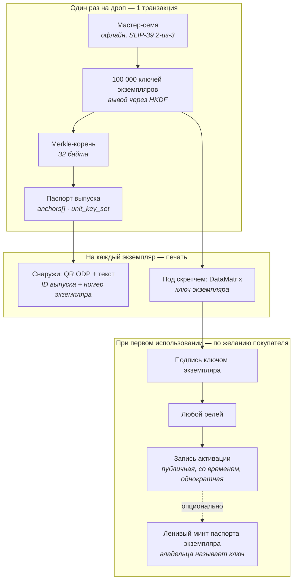

> **Исторический материал, заменён для ABI `0.7-redesign-7`.** Старые диаграммы, unit-passport/owner hooks, запрет отзыва после первой активации, derivation от passportId и готовность reader заменены. ABI6 использует nonce-based v2 и typed commitment без unit-passports; подпись/активация не доказывают владение и не гарантируют обнаружение копии. Нормативна [английская SPEC](../../SPEC.md); см. [app handoff](../../ODP_07_APP_HANDOFF.md), [глоссарий](GLOSSARY.md), [дельту](../../ODP_07_ABI6_DOCUMENTATION_DELTA.md). Эта страница не разрешает кошелёк или внешнюю сеть.

# Паспорт выпуска и ключи экземпляров

*Проектная записка для линии **v0.7**. **Ненормативная** — фиксирует принятые решения и их обоснование. Обязательные правила — **[`SPEC.md` §20](../../SPEC.md#20-edition-passports-and-unit-activation-keys-v07-line-b-profile-only)**; при расхождении верна спека.*

*Статус: черновик · Автор: Андрей Черников · Оригинал: [`docs/EDITION_UNIT_KEYS.md`](../../docs/EDITION_UNIT_KEYS.md)*

---

## 1. Какую задачу это решает

Модель v0.6 исходит из того, что паспорт — на один объект. Для картины это верно. Для серии фигурок тиражом в десятки и сотни тысяч одинаковых экземпляров — нет.

На таком масштабе ломаются три вещи:

| | Модель v0.6 (один объект) | Массовый тираж |
|---|---|---|
| Анкоры идентификации | уникальны для объекта | **одинаковы для всего тиража** — то же фото, те же размеры, те же материалы |
| Стоимость | один минт на объект, копейки | 100 000 минтов на дроп, и ~90 % из них никто никогда не прочитает |
| Пломба | NTAG 424 DNA TagTamper (~$0.30–0.60 за чип) | неподъёмно для изделия за $15 |

Значит, менять надо единицу регистрации: **паспорт описывает выпуск, а каждый физический экземпляр несёт ключ, доказывающий принадлежность к нему.**

### Только для профилей B

Это функция **профиля `B` (бренд), и запрет зашит в контракт** — это не договорённость. Кошелёк с профилем `C`, `P` или `M` не может ни заминтить паспорт выпуска, ни открыть набор ключей экземпляров (`SPEC.md` §20.1). Для этих профилей в §§6–9 ничего не меняется.

Три причины держать запрет в контракте, а не в рекомендациях:

1. Механика описывает **промышленный тираж**. Автор, регистрирующий свою работу, и музей, регистрирующий фонды, уже обслужены моделью «паспорт на объект» и здесь не получают ничего.
2. Её безопасность держится на том, что издатель способен провести контролируемую церемонию ключей (§4) и печатать на защищённом производстве. Это организационная способность, и заявляет её именно профиль `B`.
3. **Ошибочно выпущенный набор ключей нельзя отозвать поэкземплярно.** Когда 100 000 кодов напечатаны и отгружены, единственное средство — отозвать паспорт выпуска целиком. Ограничение на то, кто вообще может его создать, удерживает радиус поражения внутри профиля, за которым стоит производственный процесс.

Активация и минт паспорта экземпляра **не** ограничены: их выполняют покупатели с ключами на руках, которым не нужен ни профиль ODP, ни кошелёк.

## 2. Как это устроено в индустрии сейчас и почему этого мало

Массовый механизм проверки подлинности — им пользуется Pop Mart и практически все производители защитных этикеток — это скретч-слой, под ним серийный код, проверка по базе данных бренда. Дата, время и геолокация **первой** проверки логируются; второй проверяющий видит «код уже проверяли три недели назад в другой стране».

Механизм сам по себе разумный. Ненадёжны его основания:

1. **Судья — сам бренд.** «Подлинный» означает только «сервер бренда так сказал сегодня». Сервер можно выключить, компанию продать, базу переписать.
2. **Страница проверки и есть поверхность атаки.** По похожему домену живёт клон проверялки Pop Mart, который на **любой** код отвечает «Genuine. First Time Verification». Покупатель, перешедший по QR с поддельной коробки, получает зелёную галочку от страницы, которая ничего никуда не запрашивала. Проверить тут нечего: ответ даёт тот сервер, на который увёл код. Отдельно: инсайдер в компании или в типографии видит все коды до того, как отгружена первая коробка. (В ранней редакции здесь утверждалось, что Pop Mart публично предупреждает о клонировании кодов из утёкших баз; заявления от самой компании найти не удалось, а клон-сайт — довод сильнее и наблюдаем напрямую.)
3. **Лог первой проверки приватный.** Покупатель не может его проверить — только поверить экрану.
4. **«Записи нет» не доказывает подделку**, и «запись найдена» не доказывает подлинность.

Вклад ODP — не ещё один скретч-код, а **вынос судьи из бренда наружу**: код привязан к паспорту хэшем, первое использование — публичное событие с меткой времени, проверка работает, когда бренда уже нет.

## 3. Модель целиком



### 3.1 Паспорт выпуска

Обычный паспорт ODP, один на выпуск, минтит профиль B, с привычным для v0.6 минимумом идентификации — анкоры описывают **выпуск**, а не отдельный экземпляр.

Добавляется один новый тип анкора:

**`unit_key_set`**

| Поле | Обяз. | Смысл |
|---|---|---|
| `merkleRoot` | да | Корень по всем листьям экземпляров |
| `unitCount` | да | Количество экземпляров в тираже |
| `leafFormat` | да | Как строится лист (см. ниже) |
| `hashAlg` | да | `sha256` в первой версии |

**Формат листа:** `leaf_i = SHA-256( uint32be(i) ‖ unitAddress_i )`

Номер экземпляра внутри листа — намеренно: он приваривает серийники к адресам ещё до печати, поэтому код от коробки №7 нельзя потом выдать за коробку №48 231.

Полный список адресов экземпляров публикуется обычным открытым файлом рядом с `.odpass` (~2 МБ на 100 000 штук, ничего секретного). Любой может пересобрать дерево и любое Merkle-доказательство из него — поэтому носителю на коробке доказательство хранить не нужно.

**Цена:** 100 000 экземпляров добавляют в блокчейн **32 байта**. Один минт, ~$0.02.

### 3.2 Обязательство о варианте для слепых коробок (опционально)

В слепой коробке упаковщик знает, какой SKU куда лёг. Опубликовать это — убить продукт; опубликовать **обязательство** — нет:

**`unit_variant_commit`** — второй Merkle-корень по `SHA-256( uint32be(i) ‖ variant_i ‖ salt_i )`.

Соль напечатана на карточке **внутри** запечатанной коробки. Вскрыл — получил её; блокчейн подтверждает, что коробка №48 231 официально записана как содержащая chase-вариант. На вторичном рынке, где chase перепродаётся в 10–50 раз дороже, а заявление о редкости держится на честном слове продавца, это и есть та функция, за которую бренд действительно заплатит: **доказуемая редкость**, а не абстрактная защита от подделок.

**Почему соль лежит внутри коробки, а не выводится из ключа экземпляра.** В ранней редакции было рекомендовано выводить её из ключа — чтобы вскрытие само давало соль, а бренд выпадал из цепочки раскрытия. Это была серьёзная поломка, и её стоит оставить на виду. В слепой серии вариантов около тринадцати, то есть обязательство защищено секретностью соли и больше ничем: имея соль, любой считает обязательство для всех тринадцати кандидатов и просто читает ответ. А скретч-слой находится **снаружи** упаковки — значит перекуп мог бы стереть наклейку, не вскрывая коробку, вывести соль, узнать содержимое, оставить себе chase, а остальное продать как «запечатанное, не вскрывалось». Слепая коробка перестала бы быть слепой.

Соль внутри упаковки защищает вариант тем же картоном, что защищает и сам сюрприз, и по-настоящему убирает бренда из раскрытия: у него ничего не нужно запрашивать, и редкость остаётся доказуемой, когда бренда уже нет.

Отсюда три свойства. Неподходящая карточка **безопасна при провале**: доказать ею вариант, которого у экземпляра нет, невозможно — можно только не доказать свой. **Потерянная карточка означает, что редкость не доказать никогда**, соль невосстановима; бренд может хранить копии из вежливости, но зависеть от этого ничто не должно. И она никак не защищает от упаковщика, который знает содержимое по определению, и от взвешивания с просвечиванием — это болезни слепых коробок вообще, а не наши.

### 3.3 Ключи экземпляров

Ключи **выводятся, а не хранятся**:

```
на стороне издателя:
  masterSeed     = 256 случайных бит, генерируется офлайн
  unitSecret_i   = HKDF-SHA256(masterSeed, info = editionContext ‖ uint32be(i))
  printedSeed_i  = первые 100 бит unitSecret_i          ← вот это и печатается

на любой стороне, только из напечатанного кода:
  unitKey_i      = ключ secp256k1 из SHA-256("ODP-UNIT-KEY-v1" ‖ printedSeed_i ‖ editionContext)
  unitAddress_i  = соответствующий адрес
```

Разделение здесь принципиально. Издатель выводит всё из одного мастер-семени; покупатель, у которого нет ничего, кроме 20 стёртых знаков, приходит к тому же адресу, не нуждаясь ни в чём, что осталось у издателя. В ранней редакции печатаемое значение и выводимый ключ были разного размера, и мост между ними не был описан — покупатель до ключа фактически не добирался.

`editionContext` привязывает вывод к конкретному выпуску, чтобы ключи разных дропов не пересекались.

Следствие: бренд хранит **одно семя**, а не сто тысяч секретов.

### 3.4 Печатаемый код

| Свойство | Решение |
|---|---|
| Основной носитель | **DataMatrix под скретч-слоем** — стёр, навёл камеру, готово |
| Запасной | 25 знаков текстом, на случай смазанного символа |
| Формат текста | 20 знаков полезной части (~100 бит) + 5 контрольных, Crockford Base32 (без `O/0`, `I/1`, `L`, `U`) |
| Контрольные знаки | первые 25 бит `SHA-256(полезная часть)` |
| Минимум энтропии | **≥ 80 бит — жёсткое требование** |

**Контрольная сумма намеренно переиспользует SHA-256.** В ранней редакции было написано только «5 контрольных знаков, вычисленных по полезной части», без указания алгоритма — по такому тексту две реализации посчитали бы разные контрольные знаки и отвергли бы друг у друга правильные коды. SHA-256 в ODP и так жёсткая зависимость везде, то есть ни библиотеки, ни таблицы не добавляется, а 25 бит отсеивают опечатку с вероятностью примерно 1 к 33 миллионам.

**Алфавит глобальный и не локализуется.** Текстовый ввод — путь меньшинства, большинство стирает и сканирует; а алфавит по рынкам заставил бы каждый верификатор вечно угадывать, каким алфавитом набрана строка, и позволил бы одной строке означать разное в разных странах. Вместо этого описана нормализация: верхний регистр, убрать дефисы, заменить `O`→`0` и `I`/`L`→`1` до хэширования — тогда описки при переписывании всё равно дают валидный код.

Порог энтропии — прямое следствие децентрализации, и его легко проглядеть. В серверной системе восьмизначный код безопасен, потому что сервер ограничивает перебор. **У ODP сервера нет.** Список адресов открыт, проверка работает офлайн — значит, атакующий перебирает коды у себя на машине миллионами в секунду, и этого никто не видит. Короткие коды здесь недопустимы, и после печати этикеток исправить это уже нельзя.

### 3.5 Этикетка

**Снаружи, открыто** — обычная проверочная этикетка ODP, дополненная номером экземпляра: QR с ID паспорта выпуска и номером экземпляра плюс оба значения **человекочитаемым текстом**.

Спека фиксирует, *что должно извлекаться*, а не то, чем это закодировано. Важнее всего именно текстовая строка: форматы носителей за время жизни протокола меняются, и пара значений, которую человек может набрать руками, — это то, что сохраняет экземпляр проверяемым, когда они поменяются.

**Сильный аргумент для ЕС — не носитель, а требование о резервировании.** Регламент (EU) 2024/1781 требует, чтобы паспорт продукта резервировался через независимого стороннего провайдера сервиса цифровых паспортов — чтобы запись пережила выпустившего её оператора. Это не формат, который ODP случайно разделяет; это свойство, которое ODP даёт по построению, потому что реестр — публичная цепочка, а верификатор — кто угодно. У комплаенс-офицера под это уже есть статья бюджета.

**GS1 Digital Link — задокументированный следующий шаг, а не требование.** Бренд с GTIN может закодировать вместо этого GS1 Digital Link, и тогда один символ обслуживает сканеры ритейла, проверку ODP и резолвер EU DPP по ESPR (батареи с февраля 2027, текстиль и мебель 2027–2028, электроника до 2030) — то есть бренду никогда не придётся выбирать между ODP и носителем, который ему всё равно понадобится по регуляторике.

Обязательным сейчас это намеренно не сделано, потому что перейти можно в любой момент бесплатно. Носитель — это упаковка вне цепочки, выбираемая на каждый тираж: следующий тираж меняет кодировку, не трогая ни контракт, ни реестр, ни один заминченный паспорт; уже напечатанные этикетки продолжают работать; один бренд может вести оба формата в разных дропах одновременно. Потребовать GTIN сегодня значило бы отсечь каждую студию, которая никогда не продаётся через сканер, ради выгоды, которая никуда не убежит.

**По желанию — с подписью.** Выпуск может напечатать в наружный QR подпись, проверяемую ключом, который опубликован и в паспорте, и в блокчейне. Тогда читатель в магазине без всякой сети знает, что этикетку печатал бренд. Без этого наружная этикетка — открытый текст, который напечатает кто угодно; а тот, кто её напечатал, может и держать страницу, отвечающую «подлинный», — такое уже существует (§2).

Это идея ISO/IEC 20248, но ключ подписанта берётся из паспорта выпуска, а не из PKI или DNS-записи. Стандарт оставляет управление ключами за скобками, поэтому мы заполняем пустой слот, а не нарушаем правило, — и не возвращаем зависимость от домена издателя, ради устранения которой и написано правило про список адресов. Полное обоснование — в [ADR-0011](../../docs/adr/0011-signed-outer-labels-with-an-on-chain-signer-key.md).

Подпись мешает этикетку **выдумать**, но не **скопировать**: фотография настоящей этикетки воспроизводит валидную подпись. Копирование ловит активация. Подпись необязательна, и большинство выпусков её не поставит, так что этикетка без подписи — не худшая этикетка.

**Под скретч-слоем** — DataMatrix из §3.4.

**Физическое требование:** этикетка клеится через шов упаковки так, чтобы снять её без видимых разрушений было нельзя. Это **единственная** физическая привязка во всей схеме; вся криптография стоит сверху на ней.

## 4. Церемония генерации ключей

Генерация проходит на офлайн-машине референсным CLI из состава протокола. Мастер-семя делится по **SLIP-39** (схема Шамира) в конфигурации **2 из 3**:

| Доля | Держатель |
|---|---|
| 1 | Офицер безопасности бренда |
| 2 | Другой отдел — юридический или финансовый, отдельный сейф |
| 3 | Нотариальный или банковский депозит |

Любые две доли восстанавливают семя; **одна не даёт ничего** — не половину пространства перебора, а ноль информации. В одиночку коды не восстановит никто; потеря одного сейфа не теряет тираж; для допечатки нужны двое, и это оставляет след.

На языке корпоративной безопасности это называется **split knowledge** (никто не знает секрет целиком) и **dual control** (для операции нужны минимум двое) — термины из NIST SP 800-57 Part 2 и требований PCI PIN Security. Службы безопасности брендов уже живут по ним, объяснять с нуля не придётся.

**Печать** — только на производстве с управлением процессами защитной печати, то есть по **ISO 14298**. Почему это организационный, а не криптографический контроль — см. §8.2.

**Опциональное заверение церемонии.** Новых механизмов не нужно: свидетель с профилем **P** публикует обычный `submitProof` на паспорт выпуска в `ODPPassportProofRegistry` — «церемония генерации ключей для выпуска X проведена по профилю ODP, доли разделены, семя не покидало офлайн-машину, дата такая-то». Выпуск получает существующий уровень **Attested**, который теперь говорит и о **процессе**, а не только об объекте. Ноль нового кода в ядре.

### 4.1 Чего сам ODP делать не должен никогда

**ODP не может держать долю, семя или ключ — ни для одного выпуска, ни при каких условиях.**

Обещание проекта в том, что паспорта переживут проект («что будет, если сайт проекта исчезнет? Паспорта переживут его»). Как только ODP хранит куски чужих производственных секретов, у него появляются серверы, которые нельзя выключить, ответственность, страховка и юрлицо — ровно та централизация, ради ухода от которой всё затевалось.

Роль ODP здесь — **быть текстом, а не участником**:

1. **Нормативный формат** в `SPEC.md` — вывод ключей, построение дерева, кодирование кода, анкор `unit_key_set`. Обязательно, иначе сторонний верификатор ничего не проверит.
2. **Профиль церемонии** — документ уровня рекомендации в жанре [`ISSUER_NFC_FLOW.md`](../../docs/ISSUER_NFC_FLOW.md): кто присутствует, что уничтожается, что подписывается актом.
3. **Референсный офлайн-CLI** под MIT, который бренд запускает на своей машине без сети. ODP не хранит ничего.

## 5. Активация

Активация — это **подпись**, а не обращение к сервису.

```
сообщение = разделитель домена
          ‖ chainId ‖ адрес контракта
          ‖ ID паспорта выпуска
          ‖ номер экземпляра
          ‖ действие = "activate"
подписано ключом unitKey_i
```

Правила:

- **Функция в контракте разрешена всем.** Она проверяет **подпись**, а не `msg.sender`. Отправитель транзакции — курьер и никаких прав от этого не получает.
- **Публиковать может кто угодно**: сервер бренда, маркетплейс, коллекционерский клуб, любое приложение с поддержкой ODP, минтящее со своего кошелька, или сам покупатель со своего кошелька — как последний запасной путь.
- **Подпись можно сохранить и опубликовать позже** — офлайн через год, с чужого телефона, после того как бренда не стало.
- **Записывается один раз.** Первая валидная активация пишется с меткой времени блока; последующие попытки ничего не меняют и возвращают уже существующую запись.
- **Для держателя бесплатно, когда платит спонсор** — в этом пути не нужны ни кошелёк, ни криптовалюта, ни аккаунт. Если донести некому, держатель отправляет транзакцию сам, и запись получается ровно та же. «Бесплатно» — следствие пополненного депозита, а не гарантия протокола.
- **Повторная отправка реветит.** Иначе любой, у кого есть один честный код, мог бы бесконечно переотправлять одну и ту же валидную подпись: запись не менялась бы, а комиссия списывалась бы каждый раз, разоряя того, кто платит. Реверт роняет повтор на сухом прогоне, до того как двинутся деньги.

**Спонсорство живёт в блокчейне, а не на сервере.** Блокчейн не умеет отправлять собственные транзакции — что-то вне цепочки обязано подписать и разослать, и это не меняется никаким устройством системы. Решать можно другое: где живут **правила**.

Если бренд оплачивает активации через сервер, политика невидима: она может тихо отказать одному держателю, предпочесть одни экземпляры другим или просто исчезнуть — и снаружи не отличить, что именно произошло. Если он оплачивает их через ончейн-**paymaster** (ERC-4337) с пополняемым депозитом, политика становится публичным байткодом, который любой может прочитать, а транспортом служит публичная сеть бандлеров, а не эндпоинт бренда: бренд пополняет депозит, но никогда не стоит между держателем и цепочкой. Кончился депозит — держатели публикуют сами, и ничего не ломается.

Поскольку сообщение полностью описано спекой, чтобы стать точкой активации, не нужно ни с кем договариваться — ни с брендом, ни с ODP. Именно это делает обещание «паспорта переживут нас» верным и для этой функции, а не только для реестра.

**Активация — это не минт.** Она пишет одну маленькую запись к уже заминченному паспорту выпуска. Создание паспорта отдельного экземпляра (§6) — другое действие с другой экономикой, см. ниже. Ничто в этом разделе не делает его бесплатным.

## 6. Владение: модель «на предъявителя»

При активации может быть **лениво заминчен паспорт экземпляра** — он создаётся тогда, когда реально понадобился, а не 100 000 раз заранее. Родителем указан паспорт выпуска, принадлежность доказана Merkle-доказательством, дальше — обычные правила ODP: собственные фото-анкоры владельца, append-only события, передачи, аттестации.

**Владельца называет ключ, платить может кто угодно.** Минт разрешается сообщением, подписанным ключом экземпляра, в котором адрес владельца указан явно; контракт берёт владельца оттуда, а не из того, кто отправил транзакцию.

Это следствие того, что минт платный (ниже). В ранней редакции владельцем безусловно становился адрес ключа — а раз платит минтящий, получается, что человек платит за паспорт, которым не владеет, и потом платит второй раз, чтобы забрать его себе. Указание владельца в подписи схлопывает это в одну транзакцию и закрывает все три реальных случая:

| Ситуация | Владелец, названный в подписи |
|---|---|
| У покупателя есть кошелёк | его собственный адрес — платит и владеет за один шаг |
| Бренд держит сервис минта | **адрес покупателя**, а не бренда |
| Держатель не хочет кошелёк вообще | адрес ключа — путь «на предъявителя», без изменений |

Модель на предъявителя, таким образом, остаётся вариантом, а не единственным правилом: у кого код — тот и владеет, что буквально повторяет физику кода, лежащего в коробке вместе с вещью. Потерял коробку — потерял паспорт. Перевод на настоящий кошелёк позже — одна подпись тем же ключом.

Вместе с этим появляется одна страховка — запрет минта до активации — и одна, которая была написана и намеренно убрана.

**Почему нет правила «один паспорт на экземпляр».** Оно было вписано, и эту ошибку стоит оставить на виду. Представь подделывателя, склонировавшего реальную коробку вместе с кодом, и его покупателя, который заминтил первым. При правиле уникальности держатель **подлинного** экземпляра не просто увидит конфликт — он не сможет получить паспорт вообще, никогда, из-за одной чужой транзакции. Это ровно то «оружие первого регистратора», от которого проект уже отказался, когда не стал требовать глобальную уникальность `dataHash` в v0.6. Здесь тот же довод бьёт сильнее: показанный конфликт разрешается доказательствами, запертая дверь — ничем.

Поэтому конкурирующие паспорта экземпляра разрешены, а верификатор показывает их все — время минта, владельца, профиль минтившего — без ранжирования и без вердикта. Цена честная: в реестре может оказаться два паспорта на одну фигурку, и разбирается человек — по времени активации, по личности издателя, по фотографиям.

**Минт паспорта экземпляра всегда оплачивает тот, кто минтит.** Это обычный минт: кошелёк, транзакция, сетевая комиссия.

В ранней редакции этой записки было написано, что бренд может взять расход на себя «на первый год после дропа». Это неверно, и стоит оставить как зафиксированную ошибку, а не тихо вычеркнуть: **выразить это нечем.** В протоколе нет ни эскроу, ни лимита на выпуск, ни срока действия, ни самого понятия спонсора. Любая такая договорённость живёт целиком вне цепочки — в сервисе, который бренд держит по своему усмотрению и может выключить без предупреждения. То есть ровно та зависимость, ради устранения которой всё и строится. Записать её в спеку «по умолчанию» значило бы пообещать то, чего не проверит ни один верификатор и на что не сможет опереться ни один покупатель.

У бренда, который хочет закрыть этот расход, есть ровно один честный путь: держать собственный сервис минта и платить со своего кошелька. Это коммерческое предложение конкретного бренда, а не функция протокола, и описывать его как функцию протокола нельзя.

## 7. Если код уже активирован

Верификатор **сообщает факт и дату — и на этом останавливается.** Ни вердикта, ни обвинения, ни кнопки жалобы.

Это продолжение позиции, которую v0.6 уже занимает по дублирующимся паспортам: протокол не решает, какая из двух конкурирующих записей «настоящая»; он показывает сигналы, а решение оставляет людям. У конфликта есть два невиновных прочтения — клонированный код или честная покупка б/у, — и различить их протокол не может.

`ODPCounterfeitConcern` остаётся отдельным механизмом общего назначения. В этот сценарий он намеренно **не** встроен.

## 7a. Отзыв: убран, и чем заменён

Паспорт выпуска неизменяем, как любой другой, а единственное средство v0.6 от неверной карточки — отозвать и заминтить заново. На тираже в 100 000 экземпляров это средство превращается в оружие: отзыв снимает уровень доверия целиком и блокирует дальнейшие события, то есть одна транзакция — бренда или `governance` — стирает запись у всех честных владельцев разом. Это та же запертая дверь, от которой мы отказались для паспортов экземпляров, только ключ теперь у бренда.

Поэтому отзыва как рекола нет, а вместо него две вещи.

**Окно отзыва, закрывающееся по одному факту.** Отозвать выпуск можно, только пока не активирован его первый экземпляр. Это единственное событие закрывает дверь навсегда и для всех, включая `governance`. Внутри окна опечатка, пойманная на складе, чинится обычным способом и никому не вредит; после — стереть уже ничего нельзя.

Гейтом намеренно не служит дата. Заявленная дата отгрузки зашита в неизменяемый анкор при минте, а сроки производства съезжают — значит перенос на два месяца либо захлопнет дверь, когда ещё ничего не отгружено, либо оставит её открытой, когда коробки уже в магазинах, и лечением будет только перевыпуск паспорта из-за сдвига логистики. План — не факт.

Событие «мы отгрузили», объявляемое брендом, было прописано и затем убрано. Оно закрывало окно раньше, но стоило второго механизма, второго вида события и второй вещи, которую бренд может просто не сделать, — а покрывало лишь промежуток между попаданием товара на полки и первым стёртым слоем, промежуток короткий и закрывающийся сам. Одно правило оказалось лучше двух.

**После закрытия окна отзыв заменяют объявления о выпуске.** Бренд по-прежнему может сказать, что что-то пошло не так, — заменён исправленным выпуском, утекло семя, отзыв по безопасности, — но это append-only запись, которая ничего не разрушает. Ключевое: объявление обязано показываться на паспорте выпуска **и на каждом паспорте экземпляра под ним**. Предупреждение, которое видно только в родительской записи, для человека с одной фигуркой в руках не существует.

Объявление никогда не является вердиктом об экземпляре. «У этого выпуска утёк набор ключей» — утверждение о тираже, а не о вещи в чьих-то руках.

**И объявление остаётся текстом — поля «заменён выпуском X» нет.** Это выглядит как недоделка, но это не она. Минт исправленного выпуска не спасает экземпляры, которые уже в магазинах: их ключи лежат в Merkle-корне **старого** выпуска, проверяются против него и будут проверяться всегда. У выпуска-преемника свой набор ключей, и он управляет только будущими тиражами.

Значит, экземпляры заменённого выпуска не устарели и не недействительны — фигурка в руках настоящая, код честный, проверка сходится. Структурный указатель любой интерфейс отрисует как «ваш выпуск устарел», а это ровно тот вердикт, который мы убрали из конфликтующих паспортов, из порядка минта и из самих объявлений. Текст говорит правду — «в карточке этого выпуска опечатка в имени автора, исправленная версия ODP-…» — и машина не сделает из него приговор.

## 8. Честные ограничения

Ничего из перечисленного эта схема не чинит, и ничего из этого нельзя подразумевать в продуктовых текстах.

### 8.1 Бренд знает все ключи в момент генерации

Он может тихо активировать коды сам. Пока семя не уничтожено после печати — а проверить это снаружи невозможно — этого не избежать. У индустрии та же дыра; единственное преимущество ODP в том, что он говорит об этом вслух.

### 8.2 Типография видит коды

Чтобы напечатать код, его надо знать. Никакая криптография этого не обходит. Контроль здесь физический — сертифицированное производство, учёт брака, уничтожение отходов, — поэтому в §4 назван ISO 14298, а не более хитрая схема ключей. **Деление семени эту угрозу не закрывает**; оно закрывает только последующее восстановление кодов из хранимого материала (§4).

### 8.3 Кто знает коды, тот может активировать чужие экземпляры

Инсайдер может активировать весь тираж до отгрузки — и дальше честные покупатели стирают слой и находят свои экземпляры уже активированными. Ничего не подделано, а серия выглядит бывшей в употреблении. Предотвратить это нельзя: коды известны внутри издателя по построению (§8.1, §8.2). У каждой активации есть публичная метка времени блока, поэтому правдоподобность этого времени для вещи в чьих-то руках — человеческое суждение, а об отравленном тираже можно заявить объявлением о выпуске (§7a). У Pop Mart аналогичный лог приватный, там ту же атаку даже не осмотреть.

### 8.4 Конфликт виден, но не рассуживается

Если подделыватель скопировал реальную коробку вместе с кодом и его покупатель активировал первым — настоящий владелец увидит «уже активировано». Блокчейн показывает конфликт, но не говорит, кто прав. Это по-прежнему заметно лучше, чем «записи нет → наверное, подделка», но это не вердикт.

### 8.5 Запечатанная подделка неотличима до вскрытия

Пока слой не стёрт, проверить можно только наружный QR. Поэтому наружный QR обязан показывать состояние активации — это единственный сигнал, доступный до покупки.

### 8.6 Ключ привязан к упаковке, а не к предмету внутри

На уровне выпуска код идентифицирует **коробку**. Что внутри — становится связанным только через §3.2 (обязательство о варианте) и §6 (лениво заминченный паспорт экземпляра с собственными фото-анкорами владельца).

## 9. Точки соприкосновения со стандартами

| Стандарт | Где применяется |
|---|---|
| **GS1 Digital Link** | Содержимое наружного QR; признанный по ESPR формат идентификатора для Digital Product Passport |
| **ISO/IEC 20248** («DigSig») | Компактная подписанная структура данных в штрихкоде, спроектированная под **офлайн**-проверку — тот же сценарий глазами штрихкодовой индустрии |
| **ISO/IEC 16022** | Символика DataMatrix под скретч-слоем |
| **SLIP-39** | Деление мастер-семени по схеме Шамира |
| **NIST SP 800-57 Part 2**, **PCI PIN Security** | Терминология и требования split knowledge / dual control |
| **ISO 14298** | Управление процессами защитной печати |

Отдельно стоит решить пораньше вопрос названий: проект называется **Object** Digital Passport, а регламент ЕС вводит **Product** Digital Passport. Это одновременно риск путаницы и открытая дверь: единый носитель по GS1, обслуживающий обе задачи, — причина, по которой бренду не придётся выбирать между ODP и своими обязанностями по регуляторике.

## 9a. Форма реализации

Не протокольное решение, но перестало быть свободным выбором, как только был прочитан существующий контракт. Полное обоснование — в [ADR-0008](../../docs/adr/0008-unit-surface-is-a-satellite-with-three-core-hooks.md).

**Почти всё — спутник `ODPEditionUnits`:** открытие набора ключей выпуска, активация, минт паспортов экземпляров через штатный путь ядра и все чтения. Три причины, по убыванию веса: `freeze()` блокирует все записи в основном реестре, но не трогает спутники — если активация живёт в ядре, заморозка брошенного экспериментального реестра заморозит активацию для товара, который уже у покупателей; поверхность активации — самая открытая, разрешённая всем и оплачиваемая спонсором, и ей нечего делать в одном хранилище с неизменяемым ядром паспорта; спутник можно заменить, а передеплой ядра — это новый реестр, за которым не последует ни один существующий паспорт.

**Три вещи спутником быть не могут:**

1. **Явный начальный владелец при минте.** Сейчас минт жёстко пишет `owner: principalWallet`, а `transferPassport` доступен только владельцу — значит спутнику пришлось бы заминтить на себя, побыть владельцем чужого паспорта и потом передать. Две записи и окно, которого не должно быть ни у кого. В v0.7 минт принимает `initialOwner`.
2. **Односторонний замок отзыва.** Окно закрывается первой активацией, но активация живёт в спутнике; спутник ставит необратимый флаг, который проверяет ядро. Направление выбрано безопасное — флаг можно только поставить, поэтому даже враждебный указатель на спутник может лишь запретить отзыв, но не разрешить.
3. **Событие kind 8** для объявлений о выпуске.

Все три — маленькие. Ядро v0.6 весит 13 309 байт при лимите 24 576, так что байты здесь никогда не были ограничением.

**Состояние референсной реализации.** `chain/contracts/ODPEditionUnits.sol` реализует `openEdition`, `activate`, `mintUnitPassport` и чтения; `ObjectDigitalPassport.sol` несёт четыре зацепки и минтит `CONTRACT_VERSION = 7`. Четвёртая — минт, чьё полномочие есть подпись ключом экземпляра, а не зарегистрированный профиль, — это то, в чём ошибался ADR-0008 и что закрывает [ADR-0010](../../docs/adr/0010-the-fourth-hook-and-uniqueness-per-unit-owner.md). 89 тестов зелёные; реестр — 16 194 байта из 24 576, спутник — 6 642.

Одна деталь, которую лучше знать заранее: Merkle-корень придётся регистрировать в блокчейне отдельным значением. `anchorsHash` фиксирует весь массив анкоров одним хэшем, а против такого хэша ни один контракт не проверит доказательство. Поэтому корень существует дважды — в анкоре и в спутнике, — и верификатор их сверяет.

## 10. Зафиксированные решения

| № | Вопрос | Решение |
|---|---|---|
| 1 | Что доказывает секрет? | И одноразовость первого использования, **и** многократное владение — через ключевую пару, а не хэш-обязательство. Секрет никогда не попадает в блокчейн, поэтому его нельзя перехватить фронтраном |
| 2 | Гранулярность паспорта | Один паспорт на **выпуск** + Merkle-корень ключей экземпляров; паспорта экземпляров — **ленивым минтом** по требованию |
| 3 | Код идентифицирует коробку или предмет? | Оба слоя: коробку — для всех, предмет — для тех, кто заминтил паспорт экземпляра |
| 4 | Формат наружного QR | GS1 Digital Link **и** идентификаторы ODP в одном символе |
| 5 | Кто может публиковать активации? | Кто угодно — контракт проверяет подпись, а не отправителя |
| 6 | Кто владеет лениво заминченным паспортом? | Ключ экземпляра (на предъявителя), позже переводится на настоящий кошелёк подписью тем же ключом |
| 7 | Поведение при уже активированном коде | Показать факт и дату. Без вердикта |
| 8 | Хранение мастер-семени | SLIP-39 2 из 3, split knowledge + dual control. **ODP не держит долю никогда** |
| 9 | Энтропия кода | ≥ 80 бит, потому что при офлайн-проверке ограничения перебора не существует |
| 10 | Кто может выпускать издание? | **Только профили `B`**, запрет в контракте. Активация и минт паспорта экземпляра не ограничены |
| 11 | Спутник или ядро? | **Не настоящая развилка.** v0.7 — это в любом случае новая линия реестра с новым контрактом, так что деление выбирается при написании кода, а не на уровне протокола |
| 12 | Отзыв выпуска | **Убран.** Отзыв живёт только до первой активации — дальше закрыт навсегда и для всех, включая `governance` |
| 13 | Чем закрывается окно | Одним наблюдаемым фактом — первой активацией. Заявленная дата не годится: неизменяемый анкор не умеет следовать за съехавшей датой производства. Событие отгрузки от бренда было прописано и убрано как второй механизм, приносящий слишком мало |
| 14 | Формат наружного носителя | Спека фиксирует, что должно **извлекаться** (ID выпуска + номер экземпляра, и то же текстом), а не кодировку. GS1 Digital Link — задокументированный шаг на будущее, переходится на любом тираже бесплатно |
| 15 | Как сказать, что что-то не так, потом | Append-only объявление о выпуске, показываемое на выпуске **и** на каждом паспорте экземпляра под ним, и никогда не вердикт об экземпляре |
| 16 | Контрольная сумма и алфавит кода | Первые 25 бит `SHA-256(полезная часть)`; алфавит один глобальный, не локализуется, нормализация описана до хэширования |
| 17 | Кто и как платит за активацию | **Ончейн-paymaster** (ERC-4337) с пополняемым депозитом, транспорт — публичная сеть бандлеров, а не сервер бренда, политику которого никто не может осмотреть. Повторная отправка реветит, поэтому разорить спонсора переотправкой нельзя |
| 18 | Указатель с заменённого выпуска на замену | **Только текстом.** Структурного поля нет: преемник управляет будущими тиражами и не обесценивает экземпляры, уже находящиеся у людей, а машиночитаемый указатель отрисовали бы именно как такой вердикт |
| 19 | Где живёт код | Спутник для всего, кроме трёх зацепок в ядре: явный `initialOwner` при минте, односторонний замок отзыва и событие kind 8. Выбор не свободный — текущий минт жёстко задаёт владельца |
| 20 | Чем ограничен повторный минт паспорта экземпляра | Уникальность по паре `(экземпляр, владелец)`, а не по экземпляру. Повтор для того же владельца запрещён; честный держатель называет свой адрес, поэтому запертой двери ни у кого нет. Месячные лимиты к этому пути не применяются |
| 21 | Порог энтропии кода | **На одну цель**: `≥ 80 + ceil(log2(unitCount))` бит, но не ниже 80. Плоский порог делится на размер тиража: подделке годится любой валидный код на любом номере |
| 22 | Где живёт список адресов экземпляров | **В бандле `.odpass`**, хэш — в анкоре; URL это зеркало. Без списка нет ни доказательства, ни активации вообще |
| 23 | Назначение номеров | Независимо от коробов, регионов и волн — последовательные номера сливали бы региональные продажи через публичный лог активаций |
| 24 | Подписанные наружные этикетки | Опционально, ключ подписанта в паспорте и в блокчейне, а не в PKI или DNS — офлайн-проверка до покупки без возврата зависимости от домена. Мешает выдумать, не мешает скопировать |

## 11. Открытые вопросы

На уровне протокола — нет, и контракты готовы. Осталось то, что **§20 пока некому применить**: нет инструмента издателя и нет страницы активации, поэтому все вызовы до сих пор шли из тестов. Издательская сторона расписана для реализации в [`EDITION_ISSUER_TOOL.md`](../../docs/EDITION_ISSUER_TOOL.md); активация покупателем идёт следом, потому что пока не открыт ни один выпуск, активировать нечего. Перевод §§1–19 `SPEC.md` с v0.6 на v0.7 ждёт деплоя с настоящими адресами.

