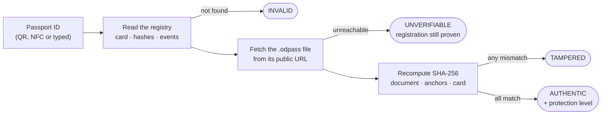
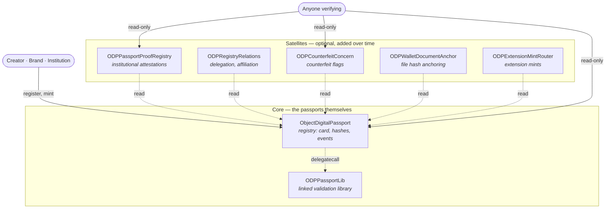

<p align="center">
  
</p>

<h1 align="center">Object Digital Passport</h1>

<p align="center"><b>A free, open digital passport for real things — art, limited editions, archives — that anyone can verify. Forever.</b></p>

<p align="center">
  <a href="LICENSE"></a>
  <a href="SPEC.md"></a>
  <a href="https://github.com/object-digital-passport/specifications/actions/workflows/ci.yml"></a>
  <a href="https://object-digital-passport.github.io/"></a>
  <a href="https://github.com/object-digital-passport/specifications/wiki"></a>
  <a href="https://github.com/object-digital-passport/specifications/discussions"></a>
</p>

<p align="center">
  🇬🇧 English · 🇷🇺 <a href="README.ru.md">Русский</a> — want another language? <a href="https://github.com/object-digital-passport/specifications/discussions">Tell us in Discussions</a>
</p>

---

## What is this?

**Object Digital Passport (ODP)** gives a physical or digital object a passport that proves three things:

1. **When** it was registered — a blockchain timestamp nobody can backdate;
2. **Who** registered it — a public profile ID you can cross-check on the issuer's own website;
3. **That its description hasn't changed since** — cryptographic fingerprints of every photo, measurement, and distinguishing feature.

No company in the middle. No subscription. Verifying is **always free** and will still work in 50, 100, or 250 years — because the registry lives on a public blockchain (Polygon), not on anyone's server. **What that promise is:** a registry, once deployed, keeps answering for as long as the chain does. **What it is not:** a promise that one address serves every generation — each `v0.x` line is a separate registry and passports do not migrate between them, so a passport verifies forever against *its own* line (SPEC.md §7). Registering costs only the network fee (~$0.01–0.03). The protocol itself charges **nothing, ever**. MIT-licensed, end to end.

**The goal: make faking an object's history as hard as possible — for pennies.**

> ⚠️ **Alpha status:** the contract may still change between 0.x versions, which can affect early passports and accounts. For long-term use, wait for the stable release — target: **January 2027**.

---

> ## 🙋 We're looking for people — yes, you
>
> Here's the honest part. I'm **Andrei Chernikov** — a contemporary artist, entrepreneur, and family-history archivist. I build this project **completely alone and without a programming background: it's all vibecoding**, AI-assisted coding steered by product vision rather than an engineering degree.
>
> That's exactly why the project needs **real people**: developers to review and harden what exists, testers to break it, designers, translators, artists and collectors to try it on real objects — and skeptics to tell us where we're wrong.
>
> You don't need to be a blockchain expert. If this page made you curious, there is a task for you: start in [**Discussions → "We need your help!"**](https://github.com/object-digital-passport/specifications/discussions), or just open an issue.
>
> **Object Digital Passport is for people and by people.** With a real community around it, we can make the world just a little bit harder to counterfeit.

---

## Try it in 2 minutes

- **Verify an object** — open the [**Verify page**](https://object-digital-passport.github.io/verify.html), enter a Passport ID or drop an `.odpass` file. No wallet, no cost.
- **Create your first passport** — the [**Quick Start**](https://github.com/object-digital-passport/specifications/wiki/Quick-Start) walks you through it (a throwaway wallet and a few cents of POL is all it takes).
- **Just look around** — the [**live demo**](https://object-digital-passport.github.io/) runs the full UI in your browser.

---

## How it works — in plain words

When you register, you get a **public profile ID** (like `C-482-930-174-005`). You publish it on your own website or social profile — that's how people know the ID is really you. This is not a suggestion; the whole trust model depends on it.

When you passport an object, you describe it the way museums and police describe objects for identification (the [Object ID](https://icom.museum/en/resources/standards-guidelines/objectid/) principle): photos, dimensions, materials, and the **distinguishing features** a forger can't easily copy — that repaired tear, that chalk mark on the stretcher. Since v0.6:

- a small readable **card** (title, author, short description) lives directly on-chain — the object is legible even without its file;
- all identification facts live in one **`anchors[]`** block, fingerprinted on-chain — and a passport *won't mint at all* without the hard minimum (photo + dimensions + materials + distinguishing features);
- the object's history is **append-only**: sales, damage, restoration are events that can be added but never rewritten.

The full description travels in a portable **`.odpass`** file that you keep and share; the blockchain stores its fingerprints. Change one comma — the fingerprint stops matching, and every verifier sees it.

When someone verifies your object, the page shows an at-a-glance **protection level** — **Base** (the identification minimum checks out), **Sealed** (＋a tamper-evident or NFC seal), **Attested** (＋an institution vouched for it). It's recomputed live from the chain on every check, never a sticker you can print — so it can't go stale or be faked.

ODP is a tool in human hands, not a magic wand: it makes forgery expensive and detectable, and it gives experts, buyers, and institutions the same tamper-proof facts to reason from.

### What a check actually does



Every step is read-only and free: no wallet, no account, no permission from us. Full algorithm: [`SPEC.md` §11](SPEC.md).

---

## Under the hood

The registry is deliberately split. Ethereum caps a contract at 24 KB, so the core stays small and everything optional lives in **satellites** — separate contracts that read the main registry but can be added later without redeploying it or moving anyone's passports.



Live addresses: [`docs/GUIDE.md` → Current Release](docs/GUIDE.md#current-release).

---

## Run it locally

The UI is plain static HTML — no build step, no server framework:

```bash
git clone https://github.com/object-digital-passport/object-digital-passport.github.io.git
cd object-digital-passport.github.io
TMP=$(mktemp -d) && cp -r frontend/. "$TMP/" && cp -r backend "$TMP/backend" && cd "$TMP"
python3 -m http.server 8000    # then open http://localhost:8000/verify.html
```

Working on the contracts instead:

```bash
cd chain/deploy && npm ci && npm test
```

---

## Who is it for?

| Prefix | Account type | Who |
|---|---|---|
| **C** | Creator | Individual artists, photographers, makers |
| **B** | Brand | Studios and brands releasing products (higher issuance limits) |
| **P** | Proof institution | Galleries, auction houses, expert bodies that attest objects |
| **M** | Museum | Museums and large collections, incl. works by deceased artists |

The type prefix is itself a first verification marker: a "museum" account passporting a living artist's new work is your first red flag 🚩

---

## FAQ

**Why should I bother?**
To protect your works from counterfeits — and to build an "indestructible" catalogue of what you've made, with proof of when.

**Do I need to understand crypto?**
Only the basics: install a wallet, keep the recovery phrase safe, top it up with a couple of dollars of POL. Use a dedicated wallet for ODP, not the one with your savings.

**What if the project's website disappears?**
Your passports survive. The registry is on a public blockchain and the code is MIT — anyone can host a verifier. That independence is the whole point.

**Can I edit a passport later?**
The core — never. That's what makes it trustworthy. What changes over time (owner, condition, location) is recorded as append-only **events**: new entries, never rewrites. A typo in the core means revoking and issuing a fresh passport.

**What does it cost?**
~$0.01–0.03 in Polygon network fees per registration or passport. Verification is free. The standard itself takes no commission — by design, forever.

**Where's the technical meat?**
Start at the [**Wiki**](https://github.com/object-digital-passport/specifications/wiki) for friendly explanations, then go normative: [`SPEC.md`](SPEC.md).

---

## 📚 Learn more

| Where | What |
|---|---|
| [**Wiki**](https://github.com/object-digital-passport/specifications/wiki) | Friendly guides: Quick Start, how verification works, NFC seals, Object ID, FAQ — 🇬🇧/🇷🇺 |
| [`SPEC.md`](SPEC.md) | The full protocol specification (normative, English) |
| [`docs/GUIDE.md`](docs/GUIDE.md) | The detailed long-form guide |
| [`docs/V0.6.md`](docs/V0.6.md) | What's new in v0.6 — the storage-model redesign |
| [`CHANGELOG.md`](CHANGELOG.md) | Notable changes across protocol lines |
| [`docs/SECURITY.md`](docs/SECURITY.md) | Threat model and security recommendations |
| [`docs/CONTRIBUTING.md`](docs/CONTRIBUTING.md) | How to contribute |
| [Live demo →](https://object-digital-passport.github.io/) | Try everything online |

**Repository layout:** [`SPEC.md`](SPEC.md) — the standard · [`chain/`](chain/) — contracts & tests · [`schema/`](schema/) — JSON Schema & vectors · [`docs/`](docs/) — documentation. The reference website is a separate repository: [object-digital-passport.github.io](https://github.com/object-digital-passport/object-digital-passport.github.io).

---

<p align="center">
  <b>💬 <a href="https://github.com/object-digital-passport/specifications/discussions">Join the Discussion</a></b> — head to <b>"We need your help!"</b> and we'll find the task where you can contribute most.<br><br>
  Thanks for reading this far. If you want to help — or know someone who might — <b>we're waiting for you!</b>
</p>
